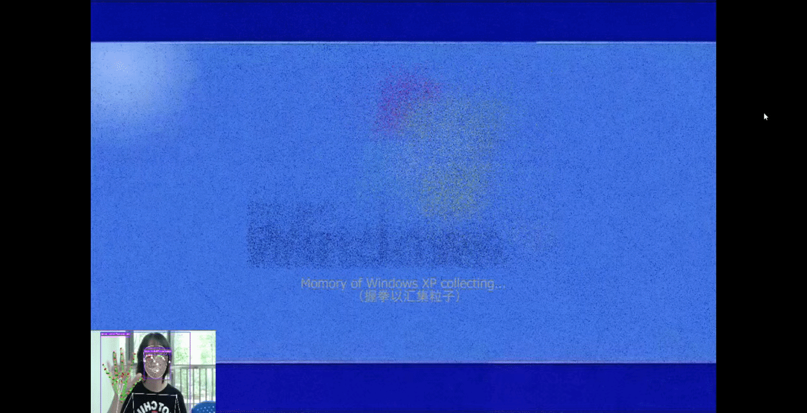

# 🖥️ Back to the Millennium

> **An interactive TouchDesigner installation that recreates digital memories from Windows XP to Windows 11 through AI, gesture recognition and immersive interaction.**


---

# 📖 Overview

**Back to the Millennium** is an interactive installation that explores how digital technology preserves our memories.

Inspired by the nostalgic Windows XP era, the experience guides users through a journey from **Windows XP** to **Windows 11**, combining classic desktop interactions with modern AI technologies.

Rather than simply recreating old operating systems, the project encourages users to explore familiar interfaces, communicate with an AI "online friend", discover hidden clues, and unlock the transition into a new digital era.

---

# 🎬 Interactive Preview

## ✨ Windows XP Boot Animation

Users reveal the Windows XP logo by making a fist, allowing particles to gather and gradually form the startup animation.



---

## ✋ Gesture-controlled Music Player

Hand gestures are used to control multimedia playback, creating a more immersive interaction experience.


---

## 🤖 AI-powered QQ Conversation

Users communicate with an AI "online friend" to obtain clues and continue the story.


---

## 💙 Windows Upgrade Sequence

After entering the correct password, the system simulates a Windows Blue Screen before upgrading into Windows 11.


---

# 🛠 Technologies

- TouchDesigner
- Python
- MediaPipe
- UniASR Speech Recognition
- ChatAI
- CHOP Execute DAT
- Timer CHOP
- Count CHOP
- Audio CHOP

---

# 📷 Screenshots

### Windows XP Startup


### Windows XP Desktop


### AI Conversation


### Windows 11


---

# 💡 Design Concept

Digital devices preserve more than files—they preserve memories.

This project uses the Windows XP operating system as a symbolic representation of the early Internet era. Through gesture interaction, speech recognition and AI conversation, users revisit familiar digital experiences while reflecting on the relationship between technological evolution and personal growth.

---

# 🎮 Interaction Flow

```text
Gesture Recognition
        ↓
XP Startup
        ↓
Desktop Exploration
        ↓
Music Interaction
        ↓
AI QQ Conversation
        ↓
Password Puzzle
        ↓
Blue Screen Transition
        ↓
Windows 11
```

---

# 👨‍💻 My Contributions

- Designed the overall interaction experience
- Developed the TouchDesigner interaction logic
- Implemented gesture-based interaction
- Integrated AI dialogue workflow
- Implemented speech recognition
- Designed desktop exploration mechanics
- Developed scene transitions and multimedia interaction
- Designed the final presentation and exhibition materials

---

# 📄 Project Poster


---

# 🚀 Future Improvements

- Richer interactive narratives
- More nostalgic software simulations
- More AI-driven conversations
- Longer storytelling experience
- Additional collectible memory fragments

---

# 🏆 Award

**🥇 First Place — TouchDesigner Course Exhibition**

---

# 📜 License

This repository is intended for portfolio and educational purposes only.
